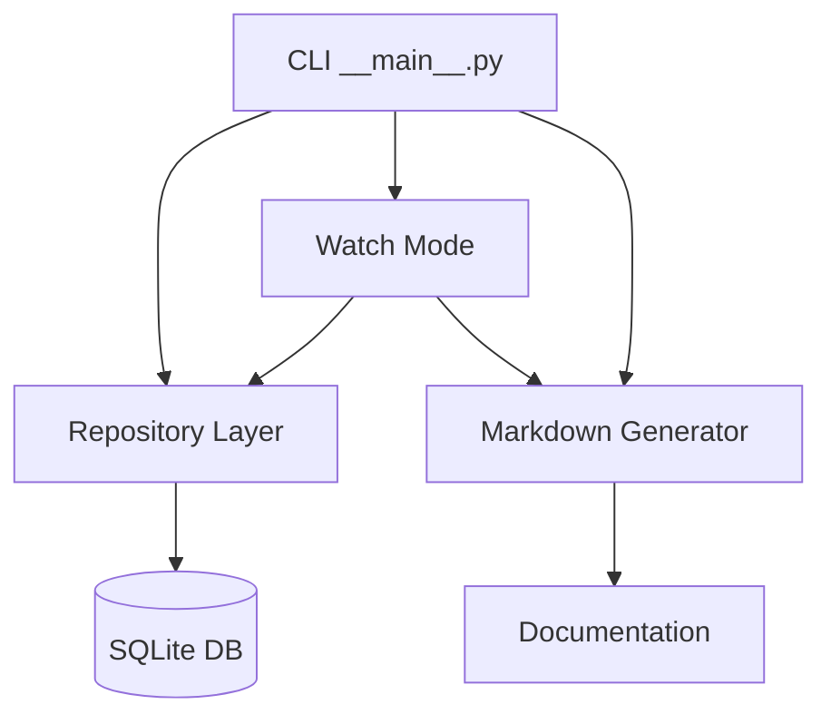

# Was Doing Wiki

Welcome to the Was Doing documentation! This wiki contains everything you need to know about using and developing Was Doing.

## 📚 User Guides

- [Onboarding Guide](onboarding.md) - Start here if you're new!
- [Installation Guide](installation.md) - System requirements and setup
- [Working with Contexts](contexts.md) - Managing projects and tasks
- [Watch Mode Guide](watch-mode.md) - Real-time documentation updates

## 🛠️ Technical Documentation

- [Project Structure](project-structure.md) - Codebase organization
- [Database Implementation](database.md) - SQLite usage and patterns
- [Development Guide](development.md) - Setting up for development
- [Contributing Guide](contributing.md) - How to contribute

## 📊 Architecture

## 🔍 Quick Links

- [Project README](../../README.md)
- [License Information](../../LICENSE)
- [Issue Tracker](https://github.com/yourusername/was-doing/issues)